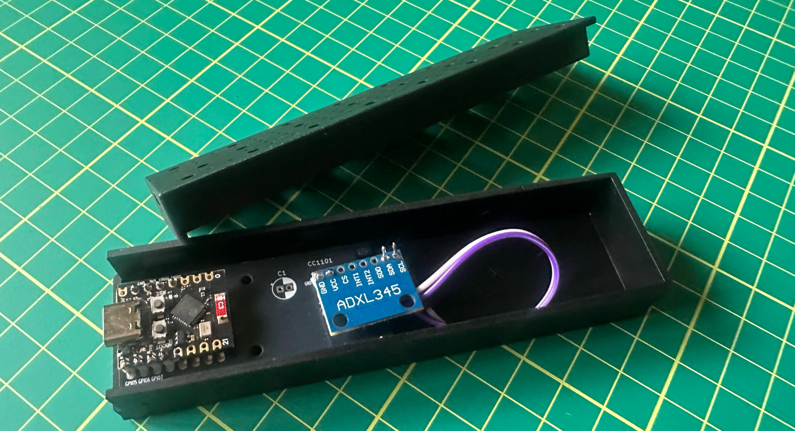

# Device Monitor via Vibration

Monitors a device that vibrates when it operates, such as a sump pump, washing
machine or AC unit, by clamping an ADXL345 accelerometer to the device (or, for
a sump pump, to the discharge pipe) and detecting the motor's vibration.

Runs on an ESP32-C3 and reports named started/stopped events, with the exact
run length, as JSON to a single Adafruit IO feed, `appliance-events`, shared by
every monitored device. One firmware serves the whole fleet: each device is a
PlatformIO environment that sets its name and tuning (see
[Adding another device](#adding-another-device)). The first device is a sump
pump.

## How it works

- Samples the ADXL345 at 400 Hz and high-passes each axis (~13 Hz cutoff) to
  reject gravity, footsteps and house rumble while passing motor vibration
  (~29-58 Hz).
- Computes RMS over 250 ms windows.
- The onboard LED is off when quiet, solid while any vibration is detected
  (e.g. picking the board up), and blinks while the device is considered running.
- Run state is debounced: `RUN_CONFIRM_MS` of continuous vibration above
  `ON_RMS_THRESHOLD` starts a run, `STOP_CONFIRM_MS` of continuous quiet below
  `OFF_RMS_THRESHOLD` ends it (3 s each for the pump).
- Each start/stop becomes an event that is queued and published to the
  `appliance-events` feed, at most one event per minute per device (a burst of
  events queues up and drains one per minute). Every event carries the time it
  really happened, so publishing delays don't distort the record. See
  [Event format](#event-format).
- Serial output (115200) prints `rms=... state=... wifi=... aio=...` once a
  second. `aio=up` means an active MQTT session with Adafruit IO.

## Wiring

| ADXL345 | ESP32-C3 |
|---------|----------|
| SDA     | GPIO 5   |
| SCL     | GPIO 6   |

GPIO 8/9 are the LED and boot strapping pins on this board, so I2C is moved
off them. The LED is on GPIO 8 (set `LED_ACTIVE_LOW` in the sketch if yours
lights on HIGH).

## Setup

Copy `src/secrets.h.example` to `src/secrets.h` (git-ignored) and fill in your
Wi-Fi and Adafruit IO credentials (shared by every device):

```
cp src/secrets.h.example src/secrets.h
```

Create the shared `appliance-events` feed in Adafruit IO. Optionally set
`NTFY_TOPIC` in `secrets.h` to enable push notifications (see
[Reliability and notifications](#reliability-and-notifications)).

Each device's name and tuning are **not** in `secrets.h`: they are build flags in
its `[env:<device>]` section of `platformio.ini` (`DEVICE_NAME`,
`ON_RMS_THRESHOLD`, `OFF_RMS_THRESHOLD`, `RUN_CONFIRM_MS`, `STOP_CONFIRM_MS`).
Build and flash a device by environment name, e.g. `pio run -e pump` (see
[Notes and gotchas](#notes-and-gotchas) for flashing). Tune its thresholds from
the `rms=` values printed with the machine idle and running.

## Event format

Every event is one JSON string, so one feed can carry any number of devices:

```json
{"device":"pump","event":"start","at":"2026-09-20T09:12:01-0400"}
{"device":"pump","event":"stop","seconds":28.8,"at":"2026-09-20T09:12:30-0400"}
```

- `device` is the environment's `DEVICE_NAME`; `event` is `start` or `stop`.
- `seconds` (stop events only) is the measured run length.
- `at` is when it really happened per the device's NTP-synced clock; omitted if
  the clock hadn't synced. Adafruit IO's own timestamp is when it arrived, which
  can lag by a minute or more because of the rate limit.
- `note` appears on corrections, e.g. `"note":"restart"` (see
  [Stuck "running" correction](#reliability-and-notifications)).

A single shared feed gives you an event timeline, not per-device charts or
gauges (Adafruit IO charts need numeric values). Per-device state tiles would
need separate feeds.

## Adding another device

1. Copy the commented `[env:washer]` template in `platformio.ini`, rename it, and
   set `DEVICE_NAME` (plain characters, it goes into JSON as-is).
2. Build that environment (`pio run -e washer`) and read the `rms=` values over
   serial with the machine idle and running, then set the thresholds.
3. Set `STOP_CONFIRM_MS` for how the machine behaves. A pump is on/off, but a
   washer pauses inside a cycle (fill, soak, drain), so it needs a long stop
   delay (minutes) or one cycle would be reported as several. The template's
   numbers are placeholders, not calibrated values.
4. The same `secrets.h` (Wi-Fi, Adafruit IO, ntfy topic) works for every device;
   ntfy messages and reboot notices are titled with the device name.

## Reliability and notifications

This is meant to run unattended, so it borrows the
self-healing approach from the
[RF ceiling fan remote](https://github.com/bradrblack/rf-ceiling-fan-remote)
firmware: recover on its own where possible, and never fail silently.

| Mechanism | Behavior |
|-----------|----------|
| **Bounded Wi-Fi connect at boot** | If Wi-Fi isn't up within 30 s, reboot and retry instead of hanging. |
| **Wi-Fi watchdog** | If Wi-Fi drops it resets the radio and retries every 30 s; if it stays down for 2 minutes, reboot. |
| **Adafruit IO watchdog** | Wi-Fi can stay associated while Adafruit IO is unreachable (DNS/TLS/auth), which the Wi-Fi watchdog can't see. Reboot if Wi-Fi is up but Adafruit IO has been unreachable for 10 minutes. |
| **I2C sensor watchdog** | Every 30 s the ADXL345's fixed device ID (`0xE5`) is read. Three failed checks in a row (unplugged, loose wire, wedged bus) reboot the board. Without this a dead sensor reads as zeros and looks like a permanently quiet pump. |
| **Sensor check at boot** | I2C bus recovery first (clocks SCL to release a bus the sensor is holding low, which a reboot alone doesn't clear), then waits for the ADXL345. If it never appears it pushes a notification after 1 minute and reboots after 30 minutes. |
| **Nightly reboot** | Once a day at 3 AM local time (`REBOOT_HOUR`, US Eastern via `TZ_STRING`, DST-aware, time from NTP) to guard against slow heap fragmentation. It is held off while the device is running or an event is still unsent, so it never drops a run in progress. The "already rebooted today" flag is stored in flash so it can't reboot-loop within the 3 AM hour. |
| **Unexpected reset detection** | A crash, hardware/task watchdog or brownout resets the chip before any of the above can run. On the next boot the reset reason is checked, and anything other than a power cycle, reset button, flashing, or our own deliberate restart is reported. |
| **Stuck "running" correction** | The last event published for this device is stored in flash. If the board reboots after a `start` and the device is really idle 15 s after boot, it publishes a `stop` with `"note":"restart"` (and no run length) so the feed doesn't imply it's still running. |

### Reboot notifications (ntfy.sh)

The reason for every self-triggered reboot is written to flash right before
restarting, then pushed to [ntfy.sh](https://ntfy.sh) once Wi-Fi is up on the
next boot, e.g. `pump rebooted: ADXL345 not responding (I2C) (reboot #2) at
2026-09-19 14:03:11 EDT` (titled with the device name). A manual power cycle leaves no reason behind, so
it stays quiet. `reboot #N` counts only exception reboots, not the nightly one.

- Set `NTFY_TOPIC` in `secrets.h` to a random, unguessable topic (topics are
  unauthenticated) and subscribe to it in the ntfy app. Without it, pushes are
  disabled and the would-be message is only logged to serial.
- The nightly reboot also pushes by default, doubling as a "still alive"
  heartbeat for an unattended device. Set `NOTIFY_DAILY_REBOOT` to
  `false` to only be told about exception reboots.

### Started/stopped notifications

For initial testing (and as a second channel next to Adafruit IO), start/stop
events are also pushed to ntfy, titled `<device> started` / `<device> stopped`
(with the run length). At most one push per minute, and only if the state
differs from the last one pushed, so a run that starts and ends inside a minute
sends nothing (unlike the feed, which records every event). Set
`NOTIFY_RUN_STATE` to `false` in the sketch to turn these off once you trust the
detection. Requires `NTFY_TOPIC`.

### Not ported from the fan project

The SinricPro watchdog is replaced by the Adafruit IO watchdog above, and the
CC1101 radio watchdog is replaced by the I2C sensor watchdog. The clock-jump
detection and OTA/WiFiManager pieces weren't carried over.

## Notes and gotchas

- `platformio.ini` uses `lib_ignore` for WiFi101 and WiFiNINA. Adafruit IO's
  dependency list pulls them in and their `WiFi.h` shadows the ESP32 one,
  which makes `WiFi.status()` hang.
- Wi-Fi TX power is capped (`WIFI_TX_POWER`, 15 dBm). At full power this
  ESP32-C3 mini board joined Wi-Fi on only ~1 in 3 boots. 8.5 dBm gave 4 of 4
  boots (about 7.5 s to connect) and 15 dBm gave 5 of 5 (4.6-5.8 s). If a board
  is flaky at 15 dBm, drop to `WIFI_POWER_8_5dBm`.
- Log lines are timestamped (wall-clock time once NTP syncs, uptime before
  that) and the boot banner prints `FIRMWARE_VERSION`; bump it on each flash
  you want to identify later.
- `pio run -t upload` currently crashes with the default esptool 5.4.0 (progress
  bar bug with esp-pylib 1.1.5) and can leave the board unbootable
  (`No bootable app partitions`); reflashing as below recovers it. Build with
  `pio run -e <device>`, then flash the combined image with an esptool 4.x
  install (`pip install esptool==4.11.0` in a venv):

  ```
  esptool.py --chip esp32c3 -p <port> -b 115200 write_flash 0x0 .pio/build/<device>/firmware.factory.bin
  ```

- The USB port name changes each time the board re-enumerates; close any
  serial monitor before flashing.

## Future ideas

### Battery-powered version (deep sleep + accelerometer wake)

Not planned yet; parked for later. The idea is to sleep the ESP32 and let the
ADXL345 wake it:

1. ESP32 deep sleeps. The ADXL345 watches for motion (~25 uA) using its
   activity interrupt and drives INT1.
2. On wake, sample ~3 s with the existing RMS/continuity logic. Footsteps and
   bumps fail the check and it goes back to sleep.
3. On a confirmed run: join Wi-Fi, publish a `start` event, then re-arm the ADXL to
   interrupt on *inactivity* (up to 255 s of no motion) and sleep.
4. On inactivity wake: publish a `stop` event, re-arm for activity, sleep.
5. Keep cycle count and last published state in RTC memory
   (`RTC_DATA_ATTR`) so the one-per-minute publish limit survives sleep.

Things to sort out first:

- Wire ADXL345 INT1 to a deep-sleep-capable GPIO (0-5 on the C3), e.g. GPIO 4.
  Reading `INT_SOURCE` clears the interrupt; wake is level-triggered.
- Board sleep current matters most: the bare chip sleeps at ~5 uA, but many dev
  boards (USB chip, power LED, regulator) draw 100 uA to 1 mA+.
- False wakes from footsteps cost ~4 s at 30-40 mA each; raise the activity
  threshold if the house is busy.
- Wi-Fi join is the expensive step (~3-5 s at 100 mA+), fine at a few runs
  per day.
- Keep the current always-on sketch as a USB "debug mode" for threshold tuning.
